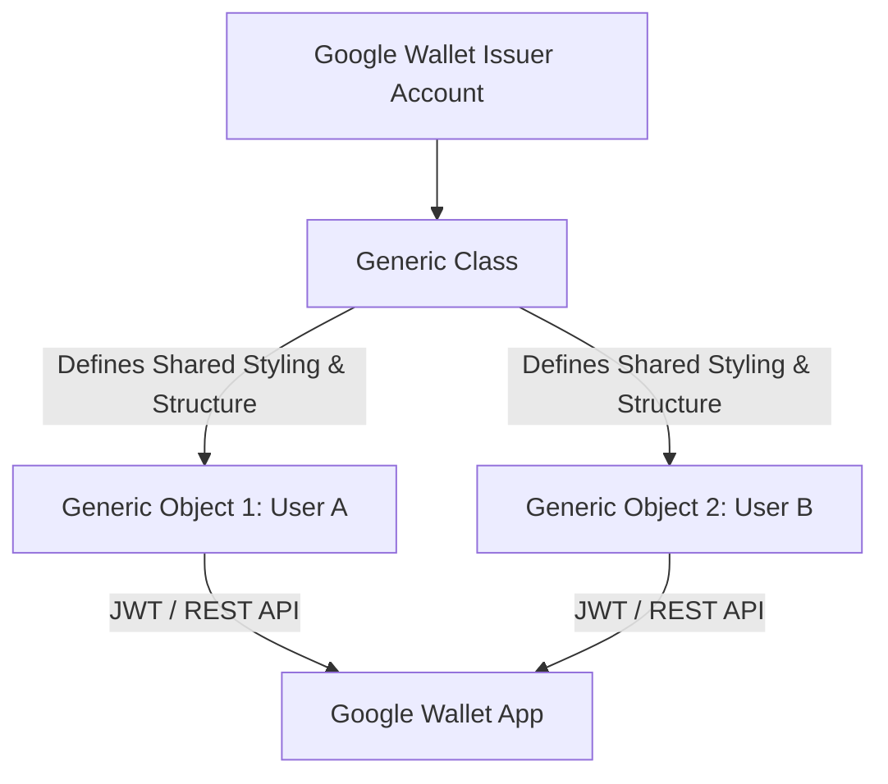

# Google Wallet Pass Implementation Guide

This guide explains how to design, generate, sign, and dynamically update Google Wallet membership passes using the Google Wallet API. It covers the architecture, service account authorization, JWT-based "Save to Google Wallet" button creation, and real-time backend synchronization.

---

## 📖 1. Core Concepts & Architecture

Google Wallet operates on a **Class** and **Object** relationship model.



1. **Issuer ID**: A unique identifier assigned when creating a Google Wallet API developer account. All Class and Object IDs must be prefixed with this Issuer ID.
2. **Generic Class (`genericClass`)**: Defines the shared structure, base template, layout, and global rules for a pass type (e.g., logo, card layout, and geolocation trigger boundaries).
3. **Generic Object (`genericObject`)**: Represents an individual user's pass instance (e.g., barcode, member name, custom field values, individual status, and hero image).

In this system, we use **Generic Passes** rather than the restrictive Loyalty/Offer templates. This gives us full design layout freedom, custom color branding, dynamic hero/strip images, and custom fields.

---

## 🛠️ 2. Google Cloud & Issuer Account Setup

Before writing code, you must configure authorization:

1. **Create a Google Cloud Project** and enable the **Google Wallet API**.
2. **Create a Service Account** in the Google Cloud Console (IAM & Admin).
3. **Generate a Service Account Key**: Download it in JSON format. You will need:
   - `client_email` (The Service Account email)
   - `private_key` (The RS256 RSA private key)
4. **Register in the Google Wallet Issuer Console**:
   - Link your Google Cloud project.
   - Note your **Issuer ID** (e.g., `3388000000001234567`).
5. **Share Class Access**:
   - In the Issuer Console, add the Service Account email as an **Editor** or **Admin** to grant it permission to write and update passes.

---

## 🔑 3. Authentication & Access Tokens

For direct REST operations (like pushing real-time updates), authenticate using the Google authentication library:

```typescript
import { GoogleAuth } from 'google-auth-library';

let auth: GoogleAuth | null = null;

export async function getGoogleAuthToken() {
    if (!auth) {
        const email = process.env.GOOGLE_WALLET_CLIENT_EMAIL?.trim();
        // Handle newline formatting from environment variables
        const key = process.env.GOOGLE_WALLET_PRIVATE_KEY?.replace(/\\n/g, '\n').replace(/^"|"$/g, '');

        if (!email || !key) {
            throw new Error('Google Wallet credentials missing');
        }

        auth = new GoogleAuth({
            credentials: {
                client_email: email,
                private_key: key
            },
            scopes: ['https://www.googleapis.com/auth/wallet_object.issuer']
        });
    }

    const client = await auth.getClient();
    const token = await client.getAccessToken();
    return token.token;
}
```

---

## 🎨 4. Data Modeling & Mapping (`genericObject`)

We map database properties to the Google Wallet JSON schema structure. Notable features include:
- **Hero Image**: Used as a custom design strip across the top of the pass.
- **Barcode**: Houses a verification link mapped to a QR code.
- **Text Modules**: Used to show metadata fields (Name, Status, Expiry, and Custom Admin Fields).

```typescript
export function buildGoogleWalletMembershipObject(
    membership: any, 
    club: any, 
    template: any, 
    baseUrl: string, 
    GOOGLE_ISSUER_ID: string
) {
    const cardConfig = membership.cardConfig as any;
    const classId = `${GOOGLE_ISSUER_ID}.contact-tree-membership-v1`;
    const objectId = `${GOOGLE_ISSUER_ID}.${membership.uid.replace(/[^a-zA-Z0-9_\-\.]/g, '_')}`;

    // Absolute URLs are required. Data URIs (Base64) are NOT allowed by Google
    const toAbsoluteUrl = (url: string) => {
        if (!url || url.startsWith('data:')) return '';
        if (url.startsWith('http')) return url;
        return new URL(url, baseUrl).toString();
    };

    const logoUrl = toAbsoluteUrl(club.logoUrl || club.brandingConfig?.logoUrl);
    const stripUrl = toAbsoluteUrl(membership.stripImageUrl);
    const isVoided = membership.status === 'expired' || membership.status === 'revoked';

    // Core Text Modules (Displayed sequentially on the back/details of the pass)
    const textModules: any[] = [
        { header: 'Member Name', body: membership.memberName, id: 'member_name' },
        { header: 'Status', body: membership.status.toUpperCase(), id: 'member_status' },
    ];

    if (membership.expiresAt) {
        textModules.push({
            header: 'Expiry Date',
            body: new Date(membership.expiresAt).toLocaleDateString(),
            id: 'expiry_date'
        });
    }

    // Map Markdown Back-Fields to Plain Text
    const customBackFields = template?.cardConfig?.backFields || cardConfig?.backFields || [];
    if (Array.isArray(customBackFields)) {
        customBackFields.forEach((field: any, idx: number) => {
            if (field.label && field.value) {
                const cleanValue = field.value.trim();
                const mdLinkRegex = /\[([^\]]+)\]\((https?:\/\/[^\)]+|mailto:[^\)]+|tel:[^\)]+)\)/g;
                // Google Wallet text fields do not support rich HTML/Markdown links natively, 
                // so we parse them into clear human-readable reference strings.
                const plainTextValue = cleanValue.replace(mdLinkRegex, '$1: $2');
                
                textModules.push({
                    header: field.label,
                    body: plainTextValue,
                    id: `custom_field_${idx}`
                });
            }
        });
    }

    return {
        id: objectId,
        classId: classId,
        ...(membership.expiresAt ? {
            validTimeInterval: {
                end: {
                    date: new Date(membership.expiresAt).toISOString()
                }
            }
        } : {}),
        genericType: 'GENERIC_TYPE_UNSPECIFIED',
        hexBackgroundColor: cardConfig.walletBackgroundColor || '#4f46e5',
        logo: {
            sourceUri: { uri: logoUrl },
            contentDescription: { defaultValue: { language: 'en-US', value: 'Logo' } }
        },
        ...(stripUrl ? {
            heroImage: {
                sourceUri: { uri: stripUrl },
                contentDescription: { defaultValue: { language: 'en-US', value: 'Banner' } }
            }
        } : {}),
        cardTitle: { defaultValue: { language: 'en-US', value: isVoided ? 'INACTIVE MEMBERSHIP' : club.name } },
        ...(cardConfig.showMembershipType !== false ? {
            header: { defaultValue: { language: 'en-US', value: membership.membershipType } }
        } : {}),
        ...(cardConfig.showMembershipNumber !== false ? {
            subheader: { defaultValue: { language: 'en-US', value: membership.membershipNumber } }
        } : {}),
        state: isVoided ? 'inactive' : 'active',
        textModulesData: textModules,
        barcode: {
            type: 'QR_CODE',
            value: `${baseUrl}/membership/${membership.slug}`,
            alternateText: 'Scan to Verify'
        }
    };
}
```

---

## 🎟️ 5. JWT-Based Pass Generation ("Save to Google Wallet")

To allow users to save their passes directly without making prior backend REST requests, sign a JSON Web Token (JWT) on the server. The user clicking this link is redirected to Google Pay, which automatically creates the class/object from the signed payload.

```typescript
import jwt from 'jsonwebtoken';

export async function handleGoogleMembershipPass(req: any, res: any, slug: string) {
    try {
        const GOOGLE_ISSUER_ID = process.env.GOOGLE_WALLET_ISSUER_ID;
        const GOOGLE_SERVICE_ACCOUNT_EMAIL = process.env.GOOGLE_WALLET_CLIENT_EMAIL;
        const GOOGLE_PRIVATE_KEY = process.env.GOOGLE_WALLET_PRIVATE_KEY?.replace(/\\n/g, '\n');

        // Fetch data
        const { membership, club, template } = await fetchMembershipDetails(slug);
        const genericObject = buildGoogleWalletMembershipObject(membership, club, template, baseUrl, GOOGLE_ISSUER_ID);

        // Fetch custom locations (Geo-trigger notifications near coordinates)
        const passLocations = getGeoCoordinates(club, template, membership);

        const newPass = {
            iss: GOOGLE_SERVICE_ACCOUNT_EMAIL,
            aud: 'google',
            typ: 'savetowallet',
            iat: Math.floor(Date.now() / 1000),
            payload: {
                genericObjects: [genericObject],
                genericClasses: [{
                    id: `${GOOGLE_ISSUER_ID}.contact-tree-membership-v1`,
                    classTemplateInfo: {
                        cardTemplateOverride: {
                            // Define front of card field placement matching the template path
                            cardRowTemplateInfos: [
                                { 
                                    twoItems: { 
                                        startItem: { firstValue: { fields: [{ fieldPath: 'object.textModulesData["member_name"]' }] } }, 
                                        endItem: { firstValue: { fields: [{ fieldPath: 'object.textModulesData["expiry_date"]' }] } } 
                                    } 
                                }
                            ]
                        }
                    },
                    ...(passLocations.length > 0 ? { locations: passLocations } : {})
                }]
            }
        };

        // Sign the JWT payload using RS256 algorithm
        const token = jwt.sign(newPass, GOOGLE_PRIVATE_KEY, { algorithm: 'RS256' });
        const saveUrl = `https://pay.google.com/gp/v/save/${token}`;

        return res.status(200).json({ saveUrl });
    } catch (err) {
        return res.status(500).json({ error: 'Failed to generate pass token' });
    }
}
```

---

## ⚡ 6. Real-Time Dynamic Updates (Push Synchronization)

When a membership is updated (e.g., name edit, photo change, manual freeze, or template update), push the changes directly to Google Wallet servers.

```typescript
export async function patchGoogleWalletObject(objectId: string, payload: any) {
    const token = await getGoogleAuthToken();
    if (!token) throw new Error('Failed to obtain Google Auth Token');

    const response = await fetch(`https://walletobjects.googleapis.com/walletobjects/v1/genericObject/${objectId}`, {
        method: 'PATCH',
        headers: {
            'Authorization': `Bearer ${token}`,
            'Content-Type': 'application/json'
        },
        body: JSON.stringify(payload)
    });

    if (!response.ok) {
        const errData = await response.text();
        throw new Error(`Google Wallet API error: ${response.status} ${errData}`);
    }

    return await response.json();
}
```

### Deletion and Revocation
To void/deactivate a pass, update the object's `state` field to `'inactive'`. This removes the card from the active deck in the Google Wallet app and shows it under expired passes.
```typescript
export async function revokeGoogleWalletObject(objectId: string) {
    return await patchGoogleWalletObject(objectId, { state: 'inactive' });
}
```

---

## ⚠️ 7. Troubleshooting & Essential Rules

### 1. Image Requirements
* **HTTPS Protocol Only**: Google's servers must be able to fetch the image directly. Localhost or private network URLs will cause an API error.
* **No Base64 Data URIs**: Passing inline base64 images under `heroImage` or `logo` will reject the payload immediately. Host them on Cloudflare R2, AWS S3, or Vercel blobs.
* **CORS Headers**: Ensure the image storage bucket (e.g., Cloudflare R2) has open `Access-Control-Allow-Origin` rules so Google can retrieve them.

### 2. ID Validation Regex
* Google Wallet IDs must comply with the regex `^[a-zA-Z0-9_\-\.]+$`.
* Ensure that the unique identifier (e.g., membership UUID) is cleaned to prevent invalid characters from crashing the signer:
  ```typescript
  const objectId = `${issuerId}.${uid.replace(/[^a-zA-Z0-9_\-\.]/g, '_')}`;
  ```

### 3. Private Key Variable Formatting
* Multiline PEM files can be corrupted when loaded through environment managers. Always double check that newline breaks are parsed correctly on startup:
  ```typescript
  process.env.GOOGLE_WALLET_PRIVATE_KEY?.replace(/\\n/g, '\n')
  ```
